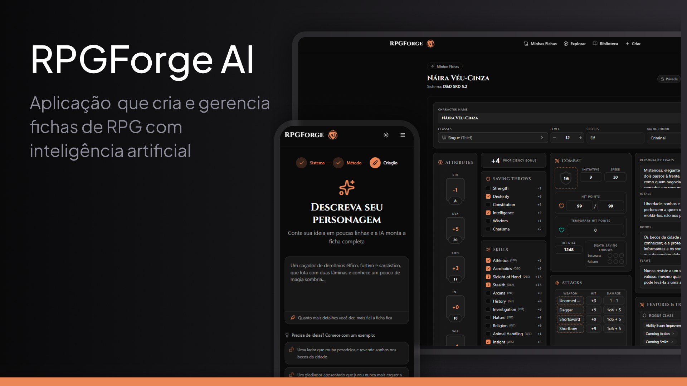

<h1 align="center"><a href="https://rpgforge-ai.vercel.app">RPGForge AI</a></h1>

<p align= "center">O RPGForge AI é uma aplicação web que cria e gerencia fichas de RPG com inteligência artificial, desenvolvida com foco em um motor de regras determinístico, geração ancorada em conteúdo oficial e controle de custo da IA</p>

<p align="center">
<a href="https://rpgforge-ai.vercel.app">🔗 Live App</a>&nbsp;&nbsp;&nbsp;|&nbsp;&nbsp;&nbsp;
<a href="#-projeto">💻 Projeto</a>&nbsp;&nbsp;&nbsp;|&nbsp;&nbsp;&nbsp;
<a href="#-decisões-de-engenharia">🧠 Decisões</a>&nbsp;&nbsp;&nbsp;|&nbsp;&nbsp;&nbsp;
<a href="#-tecnologias">🚀 Tecnologias</a>&nbsp;&nbsp;&nbsp;|&nbsp;&nbsp;&nbsp;
<a href="#-instalação">📦 Instalação</a>

<p align="center">

</p>

## 💻 Projeto

RPGForge AI é uma aplicação web para criar, editar, exportar e compartilhar fichas de personagem de RPG de diversos sistemas diferentes.

O usuário descreve o personagem que imagina em texto livre, responde de três a cinco perguntas de esclarecimento geradas na hora, e recebe uma ficha completa e jogável, com história de original. A partir daí ele edita tudo pela interface, escolhendo dentro da biblioteca do sistema: magias, feats, equipamentos, perícias, subclasse e multiclasse.

A ficha pronta pode ser publicada em um perfil público, favoritada por outros usuários e exportada em PDF, com o mesmo layout que aparece no site.

Sinta-se à vontade para criar o seu personagem!

## 🧠 Decisões de engenharia

**A IA nunca inventa conteúdo de regra.** Toda escolha que ela faz referencia um registro real do banco. A geração é ancorada por busca semântica (RAG) sobre o catálogo do sistema, com embeddings em pgvector, e a resposta do modelo é restrita a um schema Zod, então formato inválido não existe.

**A matemática não é da IA.** HP, classe de armadura, bônus de proficiência, testes de resistência e perícias são calculados por um motor de regras puro, sem framework, sem uma única dependência de runtime. O backend e o frontend chamam as mesmas funções, então servidor e cliente não conseguem discordar sobre combate.

**Cada chamada de IA é contabilizada.** Um livro-razão registra tokens de prompt, de resposta e de cache, com o custo em micro-dólar, por usuário e por etapa. Um painel administrativo mostra o gasto por modelo e por período, e há teto de uso por conta.

**Nada disso vale sem teste.** São 271 testes automatizados: o motor de regras é coberto caso a caso, e a autenticação roda em testes de integração sobre HTTP real, contra um banco PostgreSQL que a própria suíte cria, migra e derruba. Tudo que envolve sessão precisa ser provado ali.

A autenticação acompanha esse cuidado: sessão em cookies `httpOnly`, rotação de refresh token com detecção de reuso, login social com Google e Discord via OAuth com PKCE, e recuperação de senha por e-mail ou pelo próprio provedor.

## 🚀 Tecnologias

Esse projeto foi desenvolvido com as seguintes tecnologias:

- TypeScript em todo o monorepo (pnpm workspaces e Turborepo)
- Next.js 15 (App Router), React, TanStack Query e Tailwind CSS
- NestJS, Prisma ORM e PostgreSQL
- pgvector para busca semântica (HNSW, distância por cosseno)
- OpenAI com structured outputs e embeddings
- JWT em cookies httpOnly, com OAuth via Google e Discord
- Puppeteer para exportação da ficha em PDF
- Docker e Vitest

## 📦 Instalação

Siga os passos abaixo para rodar o RPGForge AI localmente em ambiente de desenvolvimento:

```bash
# Clone o repositório para o diretório desejado
git clone git@github.com:guilhermedkdk/rpgforge-ai.git

# Acesse a pasta do projeto
cd rpgforge-ai

# Instale as dependências do projeto
pnpm install

# Copie os arquivos de variáveis de ambiente
cp apps/api/.env.example apps/api/.env
cp apps/web/.env.example apps/web/.env

# Preencha os dois .env com as suas credenciais (banco de dados, JWT, OpenAI, etc.)

# Suba o PostgreSQL em container
pnpm db:up

# Crie as tabelas
pnpm db:migrate

# Carregue o conteúdo do SRD no banco (leva alguns minutos)
pnpm --filter @rpgforce-ai/api run ingest:srd

# Gere os embeddings usados pela busca semântica (consome créditos da OpenAI)
pnpm --filter @rpgforce-ai/api run embed:srd

# Inicie a API e o front em paralelo
pnpm dev
```

A API sobe em `http://localhost:4001` e o front em `http://localhost:4000`.
